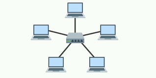
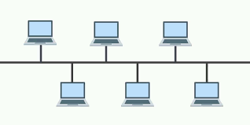
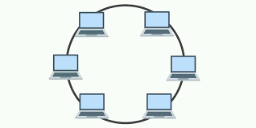
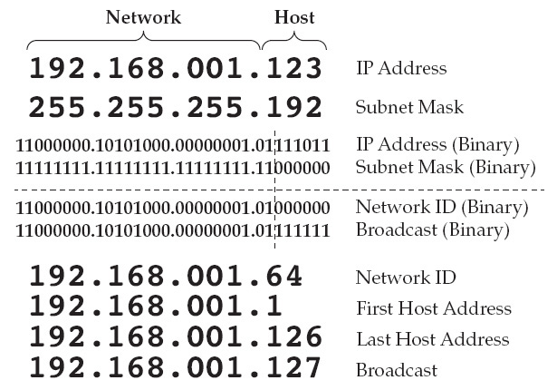

## Local Area Network (LAN) Topologies

1. [Star Topology](https://en.wikipedia.org/wiki/Star_network) :

It's easy to scale, node don't affect others nodes, appropriate for large network but it's expensive for the lenght/number of cables and if the central hub fail, everyone is affected.

---

2. [Bus Topology](https://en.wikipedia.org/wiki/Bus_network) :

Work well for small network, easy to extends and to add devices. Not expensive because it use single cable but bad performance if devices request data simultaneously and it's hard to isolate faults on the network.

---

3. [Ring Topology](https://en.wikipedia.org/wiki/Ring_network) :

Very orderly and fast, this network scale better than bus network and is cheaper. Does not require central entity and easy to identify and isolate faults. However it's hard to add devices and a brokent device can break all the network.

---

### [Switch](https://en.wikipedia.org/wiki/Network_switch)

A switch is designed to agregate a multiple devices such as computer, printers or any devices using ethernet. Switch is more efficiant than hub/repeaters because they keep track of what device is connected to which port, it reduce traffic.

---

### [Router](https://en.wikipedia.org/wiki/Router_(computing))

Router are usefull for connect multiple networks between them. It does this by using routing. Routing is the label given to the process of data travelling across networks. Routing involves creating a path between networks so that this data can be successfully delivered.

---

## Subnetting

Subnetting is the term given to spliting up a network into smaller networks.
Subnets use IP addresses in three different ways :
- Identify the network address
- Identify the host address
- Identify the default gateway

Subnetting is achieved by splitting up the number of hosts that can fit within the network, represented by a number called a subnet mask.

|Type	|Purpose	|Explanation	|Example|
|-------|-----------|---------------|-------|
|Network Address|This address identifies the start of the actual network and is used to identify a network's existence.|For example, a device with the IP address of 192.168.1.100 will be on the network identified by 192.168.1.0|192.168.1.0|
|Host Address| An IP address here is used to identify a device on the subnet|For example, a device will have the network address of 192.168.1.1|192.168.1.100|
|Default Gateway|The default gateway address is a special address assigned to a device on the network that is capable of sending information to another network|Any data that needs to go to a device that isn't on the same network (i.e. isn't on 192.168.1.0) will be sent to this device. These devices can use any host address but usually use either the first or last host address in a network (.1 or .254)|192.168.1.254|

Subnetting provides a range of benefits, including :
- Efficiency
- Security
- Full control

---

