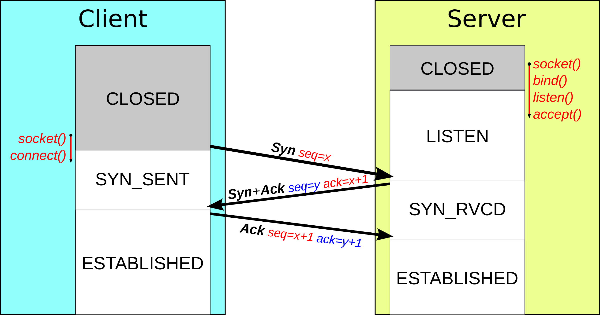

## Packets & Frames

They are small piece of data that make a larger piece of information or message when they are together. Packet contain the IP address information in contrary to frame. Packet contain the frames but they have much informations like a time to live, a checksum to check the integrity of the data, the source address and the destination address.

---

### TCP/IP

TCP/IP is very similar to OSI model. It consist of four layers and is arguably summary of the OSI model.

These layers are :
- Application
- Transport
- Internet
- Network Interface

TCP headers :

| Header | Description |
| ------ | ----------- |
| Source Port | Choosen randomly in port unsued between 0-65535. |
| Destination Port | This value is not choosen random. For exemple a webserver running port 80. |
| Source IP | Ip of the device who is sending the packet. |
| Destination IP | Ip of the device who is receiving the packet. |
| Sequence Number | When a connection occurs, the first piece of data transmitted is given a random number. |
| Acknowledgement Number | After the sequence number, the number for the next piece of data will have the sequence number + 1. |
| Checksum | Mathematical formulation that verify the integrity of the data. |
| Data | Where the bytes of the data was stored. |
| Flag | Determined how the packet should be handled by the either device. |

Every connection with TCP used the *three-way handshake*, the devices communicates using a few special messages :

| Step | Message | Description |
| ---- | ------- | ----------- |
| 1 | SYN | Initial packet sent by client during. Initiate the connection and synchronise the devices. |
| 2 | SYN/ACK | Packet sent by the server to acknowledge the synchronisation attempt from the client. |
| 3 | ACK | Can be used by the client or the server to acknowledge that a serie of packets have been successfully received. |
| 4 | DATA | When the connection has established, the datas whas sent with the DATA message. |
| 5 | FIN | Used to close properly the connection. |
| # | RST | Close abruptly the connection, used when an error occurs. |

This is a normal three-way handshake :

1 - Client sent the SYN packet with his initial sequence number to synchronise with.
2 - Server sent the SYN/ACK packet with his initial sequence number and acknowledge the initial sequence number of the client.
3 - Client sent the ACK packet to acknowledge the initial sequence number of the server.

---
