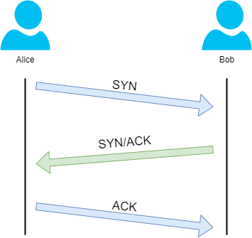
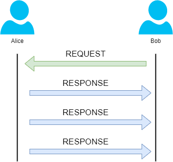

## Packets & Frames

They are small piece of data that make a larger piece of information or message when they are together. Packet contain the IP address information in contrary to frame. Packet contain the frames but they have much informations like a time to live, a checksum to check the integrity of the data, the source address and the destination address.

---

### TCP/IP

TCP/IP is very similar to OSI model. Its based on the [[TCP & UDP#TCP|TCP]] protocol. It consist of four layers and is arguably summary of the OSI model.

These layers are :
- Application
- Transport
- Internet
- Network Interface

TCP headers :

| Header | Description |
| ------ | ----------- |
| Source Port | Choosen randomly in port unsued between 0-65535. |
| Destination Port | This value is not choosen random. For exemple a webserver running port 80. |
| Source IP | Ip of the device who is sending the packet. |
| Destination IP | Ip of the device who is receiving the packet. |
| Sequence Number | When a connection occurs, the first piece of data transmitted is given a random number. |
| Acknowledgement Number | After the sequence number, the number for the next piece of data will have the sequence number + 1. |
| Checksum | Mathematical formulation that verify the integrity of the data. |
| Data | Where the bytes of the data was stored. |
| Flag | Determined how the packet should be handled by the either device. |

Every connection with TCP used the *three-way handshake*, the devices communicates using a few special messages :

| Step | Message | Description |
| ---- | ------- | ----------- |
| 1 | SYN | Initial packet sent by client during. Initiate the connection and synchronise the devices. |
| 2 | SYN/ACK | Packet sent by the server to acknowledge the synchronisation attempt from the client. |
| 3 | ACK | Can be used by the client or the server to acknowledge that a serie of packets have been successfully received. |
| 4 | DATA | When the connection has established, the datas whas sent with the DATA message. |
| 5 | FIN | Used to close properly the connection. |
| # | RST | Close abruptly the connection, used when an error occurs. |

This is a normal three-way handshake :

- Client sent the SYN packet with his initial sequence number to synchronise with.
- Server sent the SYN/ACK packet with his initial sequence number and acknowledge the initial sequence number of the client.
- Client sent the ACK packet to acknowledge the initial sequence number of the server.

---

### UCP/IP

The UDP/IP model is based on the [[TCP & UDP#UDP|UDP]] protocol that not require three way handshake like TCP because UDP does not require constant connection between the devices. It is used when data can be lost like streaming or voice communication.

UDP packets are much simpler than TCP packets:
- Time to live (TTL)
- Source address
- Destination address
- Source port
- Destination port
- Data

---

### Port

A [Port](https://en.wikipedia.org/wiki/Port_(computer_networking)) is a number between 0 and 65535 who refer to a virtual point where we can send or receive datas. A device can choose what port is listening or not.
Ports have standard rules that associate a port and a protocol by default.

Commons ports usefull in cyber security:

| Port | Protocol |
| ---- | ----------- |
| 21 | FTP (File Transfer Protocol) |
| 22 | SSH (Secure shell) |
| 80 | HTTP (Hyper Text Transfer Protocol) |
| 443 | HTTPS (Hyper Text Transfer Protocol Secure) |
| 445 | SMB (Server Message Block) |
| 3389 | RDP (Remote Desktoop Protocol) |

[Here](https://en.wikipedia.org/wiki/List_of_TCP_and_UDP_port_numbers) a list of the ports and there protocol.
